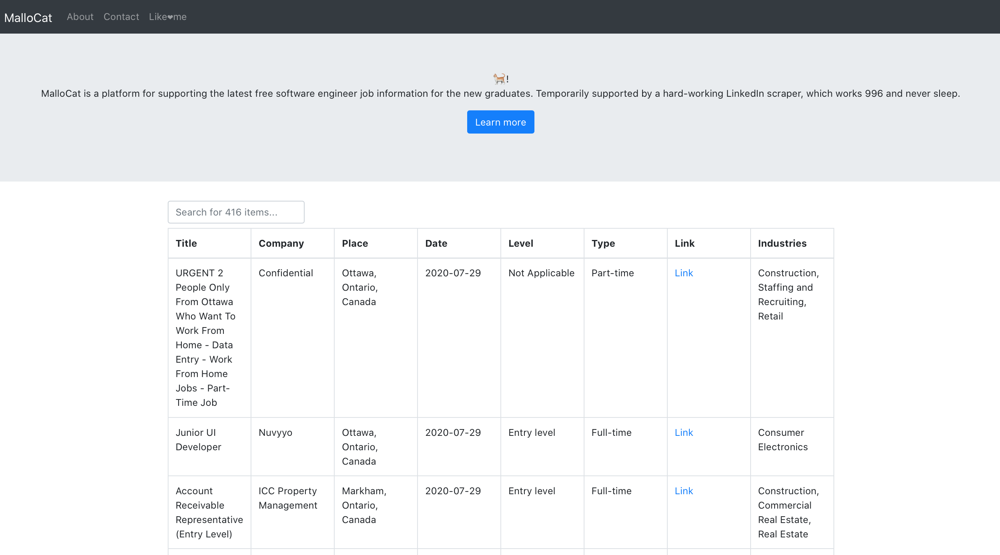

# LinkedIn Spider

This is a platform supporting the latest free software engineer job information for the new graduates.
The keywords includes software grad, entry Software, Software university, Software graduate, Software college, junior developer, will be used for LinkedIn job search.

Temporarily supported by a hard-working [LinkedIn scraper](https://www.npmjs.com/package/linkedin-jobs-scraper), which works 996 and never sleep.
**Only for self study purpose. No commercial usage allowed**

## Demo

[Try it here](https://linkedin-spider.netlify.app)

Note that the column can be `sortable`. Nimbly to use `search` for better filtering.

## Usage

To configure your system for development, first install Node.js and npm and
then run `npm install`. This will install some dependencies using npm. The Environment
I use is `Node 12.18` and `npm 6.14`.

To display the website, run `npm start`. Then visit `localhost:3000` as default. To run the
scraper, simply run `node index.js`, and wait for 2 minutes until page reloading.

## Work in Progress

## Todos

- spider server
- Differences in contrast
- push service
